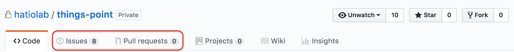
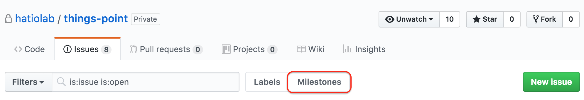
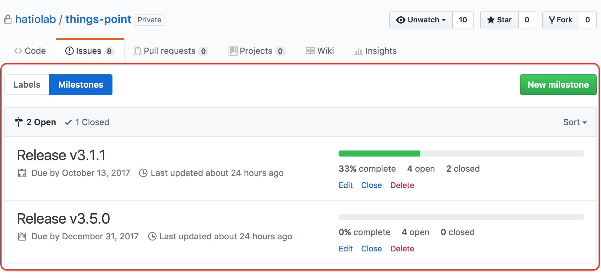
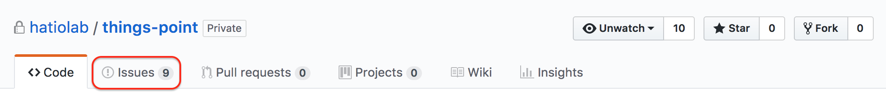
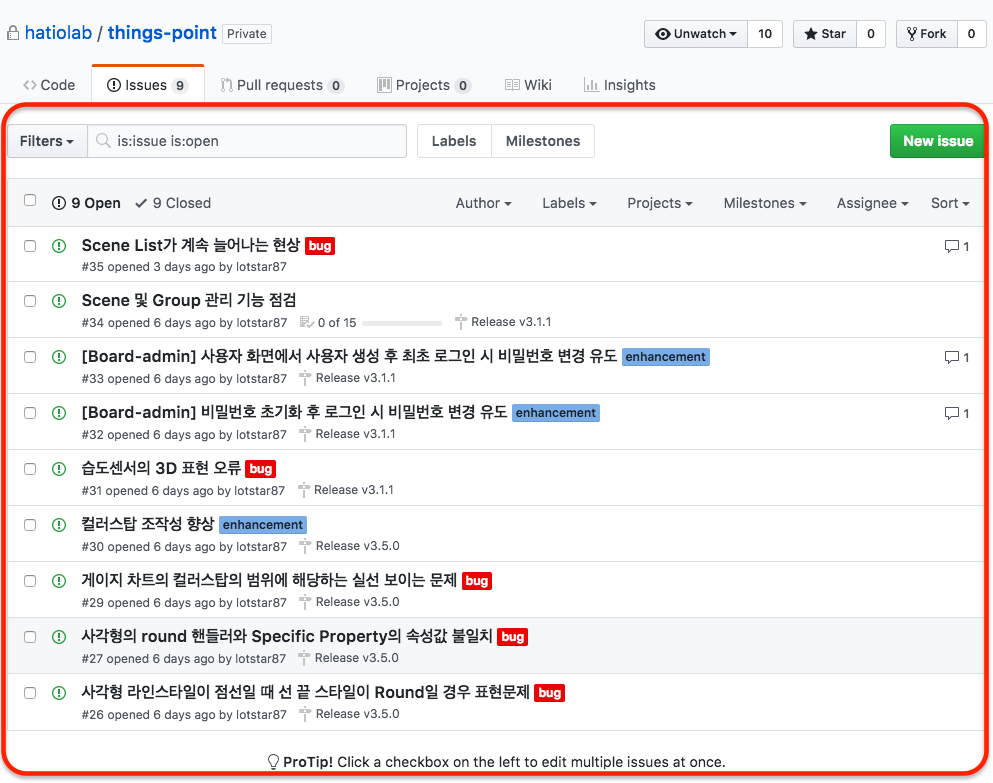
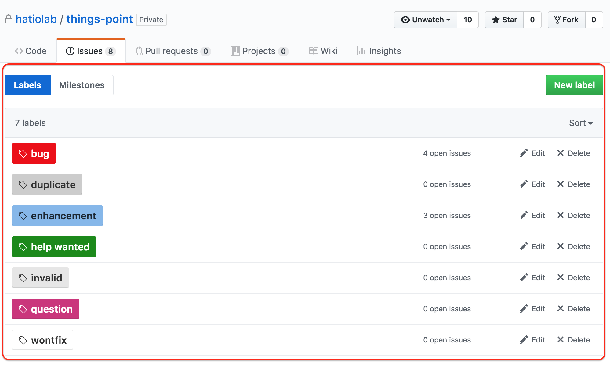
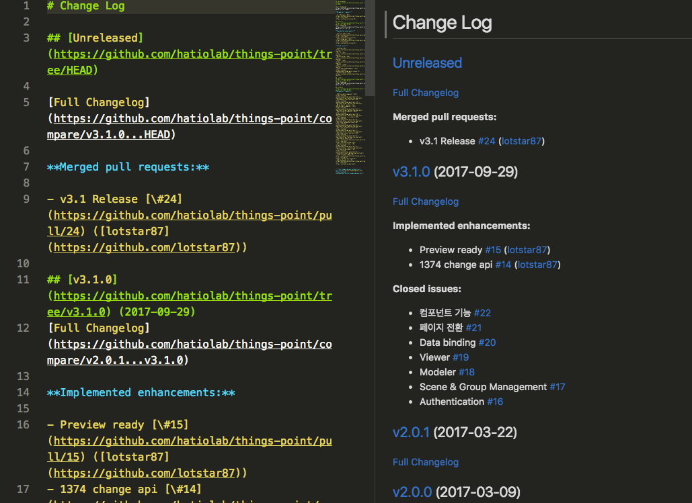

## Release Note Generator 사용하기에 앞서
Release Note Generator를 사용하려면 다음의 작업들이 선행되어야 한다.
1. Milestone 등록
1. Issue의 등록 및 유형에 맞는 Label 지정

## Milestone 관리
Milestone은 마감기한을 두고 진행되어야 하는(예를 들면, 버전업) 일에 대해 관리하기 위한 방법이다.

1. Repository의 Issues 탭을 클릭.  
  

1. Milestones 탭을 클릭.  
  

1. 해당 화면에서 Milestone의 추가, 삭제, 수정, Close 및 Milestone의 진행률 확인, Milestone에 포함된 Issue 확인 및 추가의 작업이 가능.  
   
  
## Issue 관리
Issue는 기존 redmine에서의 일감의 역할을 한다.
Issue를 등록할 때(혹은 등록 후) 알맞은 label과 milestone 등을 지정해 주는것이 좋다.

1. Issues tab을 클릭.  
 
2. 해당 화면에서 Issue 추가, 수정 등의 Issue 관리가 가능하고, issue 목록 확인 가능.  
 

## Label의 종류와 관리
Label은 Issue, PR 등의 유형을 구분짓는 용도로 사용되며, 이를 기반으로 Release Note가 생성된다.

### 기본 Label의 종류
1. bug
1. duplicate
1. enhancement
1. help wanted 
1. invalid
1. question
1. wontfix

### Label 관리
1. Issues 탭 또는 Pull Requests 탭을 클릭.  
  
1. 해당 화면에서 Label 추가, 삭제, 수정 및 Label별 Open issues 확인이 가능.  
  

## Project 관리
Project는 마감기한에 상관 없이 비슷한 종류 혹은 같이 처리되어야 할 issue(또는 PR, 일반적인 메모 등)를 관리하는 기능.

## Release Note Generator 설치 및 사용법
설치는 [https://github.com/skywinder/github-changelog-generator](https://github.com/skywinder/github-changelog-generator)를 참조.

1. Generator 실행  
  Project repository에서
    ```bash
      $ github_changelog_generator 
    ```

1. CHANGELOG.md 파일이 아래와 같이 생성되고, 필요한 부분의 MD를 복사하여 release 노트에 붙여넣어 사용. 
   